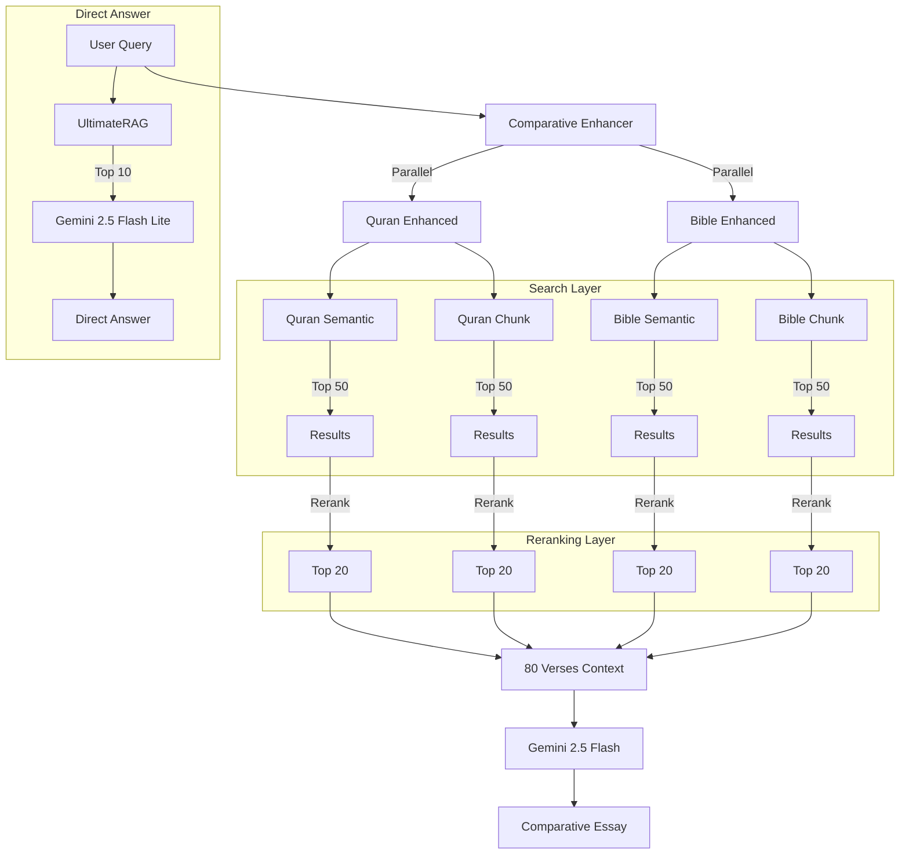

# System Patterns

## Architecture Overview



## Key Technical Decisions

### 1. Comparative Strategy

- **Parallel Enhancement**: Independent query expansion for Quran ("sabır") and Bible ("patience").
- **4-Way Search**: Coverage of Verse-level and Chunk-level semantics for both scriptures.
- **Independent Reranking**: Each result set is reranked BEFORE merging to ensure diversity.
- **Essay Generation**: Gemini 2.5 Flash synthesizes 80 verses into a coherent essay.

### 2. Dual-Collection Strategy

- **Single-verse collection** (`quran_tr`): Precise verse retrieval
- **Semantic chunks collection** (`quran_semantic_chunks`): Thematic groupings
- Parallel search on both, merged via RRF (for standard search) or Context Window (for essay).

### 3. Hybrid Search (Dense + Sparse)

- **Dense**: OpenAI `text-embedding-3-large` (3072 dim)
- **Sparse**: BM25 via FastEmbed with Turkish lemmatization
- Combined score improves both recall and precision

### 4. Lazy Loading Pattern

- Expensive resources (Reranker, Enhancer) loaded on first use
- Improves CLI startup time for non-search commands

### 5. Caching Strategy

- **Embedding cache**: DiskCache with 7-day TTL
- **Rate limiting**: 20 RPM for API calls
- **Semantic cache**: Query-level result caching

## Design Patterns in Use

| Pattern | Usage |
|---------|-------|
| **Lazy Loading** | Reranker, Query Enhancer, Searchers |
| **Strategy** | Multiple search modes (semantic, hybrid, keyword) |
| **Factory** | Searcher creation based on source type |
| **Facade** | UltimateRAG / ComparativeRAG |
| **Singleton** | Shared Qdrant client, embedding models |

## Component Relationships

```
UltimateRAG  <-- Legacy/Standard Search
ComparativeRAG <-- New Analysis Pipeline
├── ComparativeAnswerGenerator (Gemini Flash)
├── AnswerGenerator (Gemini Flash Lite) <-- NEW
├── QueryEnhancer (Shared)
├── Reranker (Shared)
├── QuranSearcher / BibleSearcher
│   ├── DenseEncoder
│   ├── SparseEncoder
│   └── QdrantClient
└── SemanticChunkSearcher
```

## Critical Implementation Paths

### Comparative Search Flow

1. `compare(query)` → `ComparativeRAG.compare()`
2. `_enhance_query_parallel()` → Quran & Bible Enriched Queries
3. `_search_all_parallel()` → 4x Async Searches (Top 50 each)
4. `_rerank_each()` → 4x Reranking (Top 20 each)
5. `generate_comparative_answer()` → LLM Context (80 verses) → Essay

### Direct Answer Flow (Ask)

1. `ask(query)` → `UltimateRAG.ask()`
2. `search()` → Standard RAG retrieval (Top 10)
3. `AnswerGenerator.generate_answer()` → Synthesis with Flash Lite
4. Output → Concise Answer + Citations

### Indexing Flow (Async/Parallel)

1. `cmd_index()` → `AsyncIndexer.index()`
2. `QuranDataLoader` / `BibleDataLoader` loads raw text
3. **Batch Processing**:
   - Text chunks are gathered into batches
   - `AsyncDenseEncoder` & `AsyncSparseEncoder` run in parallel
   - Embeddings generated via OpenAI/FastEmbed (optimized batch sizes)
4. **Qdrant Upsert**:
   - `QdrantClient` performs async upserts
   - Payload indexing happens automatically
